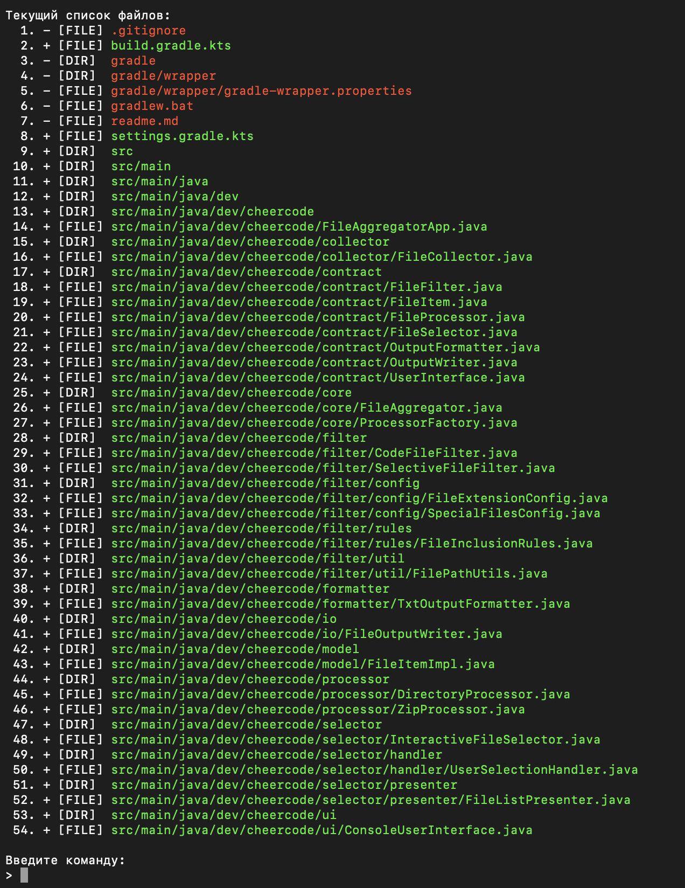

# Code File Aggregator

Утилита для сбора файлов проекта в один текстовый файл с возможностью выбора включаемых файлов.

## Описание

Code File Aggregator - это Java-приложение, которое сканирует директории или архивы, фильтрует файлы кода и
конфигурации, предоставляет интерактивный выбор файлов и объединяет их в один структурированный текстовый файл с
нумерацией строк.

## Возможности

- **Обработка директорий и архивов**: Поддержка обычных папок и ZIP/JAR/WAR/RAR архивов
- **Интерактивный выбор файлов**: Возможность включать/исключать файлы и целые директории
- **Умная фильтрация**: Автоматическое исключение служебных файлов и директорий (`.git`, `node_modules`, `target`, etc.)
- **Поддержка множества форматов**: Java, JavaScript, Python, C/C++, HTML, CSS, XML, JSON, YAML и многие другие
- **Поддержка конфигурационных файлов**: Dockerfile, package.json, build.gradle и другие
- **Цветной вывод**: Наглядное отображение включенных/исключенных файлов в консоли
- **Структурированный вывод**: файлы с заголовками, нумерацией строк и разделителями

## Поддерживаемые форматы файлов

### Языки программирования

**Основные языки:**
- Java (`.java`)
- JavaScript (`.js`)
- TypeScript (`.ts`)
- Python (`.py`)
- C/C++ (`.cpp`, `.c`, `.h`, `.hpp`)
- C# (`.cs`)
- PHP (`.php`)
- Go (`.go`)
- Rust (`.rs`)
- Swift (`.swift`)
- Ruby (`.rb`)

**JVM языки:**
- Kotlin (`.kt`, `.kts`)
- Scala (`.scala`)
- Clojure (`.clj`, `.cljs`)

**Функциональные языки:**
- F# (`.fs`, `.fsx`)
- Elm (`.elm`)
- Haskell (`.hs`)
- OCaml (`.ml`, `.mli`)

**Системные языки:**
- Zig (`.zig`)
- V (`.v`)
- D (`.d`)
- Nim (`.nim`)

**Скриптовые языки:**
- Perl (`.pl`, `.pm`)
- R (`.r`)
- Lua (`.lua`)
- Julia (`.jl`)

**Mobile/Desktop:**
- Objective-C (`.m`)
- Objective-C++ (`.mm`)
- Dart (`.dart`)
- Visual Basic (`.vb`)

**Другие:**
- Elixir (`.ex`, `.exs`)
- Erlang (`.erl`, `.hrl`)

### Веб-технологии

- HTML (`.html`)
- CSS (`.css`, `.scss`, `.sass`, `.less`, `.styl`)
- Vue (`.vue`)
- Svelte (`.svelte`)
- JSX (`.jsx`)
- TSX (`.tsx`)
- Astro (`.astro`)
- GraphQL (`.graphql`, `.gql`)

### Конфигурационные файлы и данные

- XML (`.xml`)
- JSON (`.json`)
- YAML (`.yml`, `.yaml`)
- Properties (`.properties`)
- TOML (`.toml`)
- INI (`.ini`, `.cfg`)
- ENV (`.env`)
- Protocol Buffers (`.proto`)
- Avro Schema (`.avsc`)
- XML Schema (`.xsd`)
- Property List (`.plist`)

### Системы сборки

- Gradle (`.gradle`)
- Maven (`pom.xml`)
- CMake (`CMakeLists.txt`, `.cmake`)
- SBT (`.sbt`)
- Bazel (`.bazel`, `.bzl`)
- Nix (`.nix`)
- Make (`.mk`)
- Meson (`meson.build`)

### Документация и скрипты

- Markdown (`.md`)
- reStructuredText (`.rst`)
- AsciiDoc (`.adoc`, `.asciidoc`)
- LaTeX (`.tex`)
- Org-mode (`.org`)
- Plain Text (`.txt`)
- SQL (`.sql`)

**Скрипты:**
- Shell (`.sh`, `.bat`, `.ps1`, `.zsh`, `.fish`, `.csh`)
- AWK (`.awk`)
- sed (`.sed`)

### Специальные файлы

**Конфигурации:**
- Docker (`Dockerfile`, `.dockerfile`)
- Make (`Makefile`)
- EditorConfig (`.editorconfig`)
- Prettier (`.prettierrc`)
- ESLint (`.eslintrc`)

**Управление зависимостями:**
- npm (`package.json`, `package-lock.json`)
- Yarn (`yarn.lock`)
- pip (`requirements.txt`)
- Cargo (`Cargo.toml`)
- Go (`go.mod`, `go.sum`)
- Composer (`composer.json`, `composer.lock`)
- Ruby (`Gemfile`, `Gemfile.lock`)
- Elixir (`mix.exs`)
- Julia (`Project.toml`)
- Python (`pyproject.toml`, `Pipfile`, `poetry.lock`)
- Deno (`deno.json`)
- Bun (`bun.lockb`)
- Dart/Flutter (`pubspec.yaml`)

**Документация:**
- `README` (все варианты)
- `CHANGELOG` (все варианты)
- `LICENSE` (все варианты)

**Другие:**
- `.gitignore`
- `.gitattributes`
- `BUILD` (Bazel)
- `WORKSPACE` (Bazel)
- `flake.nix`
- `shell.nix`
- `default.nix`

### Игнорируемые директории (автоматически исключаются)
- `.git`, `.svn`, `.hg`
- `.idea`, `.vscode`, `.settings`
- `node_modules`, `vendor`
- `target`, `build`, `bin`
- `obj`, `dist`, `out`
- `.gradle`, `.maven`

## Системные требования

- Java 11 или выше
- Gradle (для сборки)

## Установка и запуск

### Сборка проекта

```bash
# Клонировать репозиторий
git clone git@github.com:vasiliy-spb/Code-File-Aggregator.git
cd Code-File-Aggregator

# Собрать проект
./gradlew build
```

## Использование

1. **Запуск приложения**
```bash
java -jar build/libs/Code_File_Aggregator-1.0-SNAPSHOT.jar
```

2. **Указание пути к проекту**
    - Введите путь к директории проекта или архиву с кодом
    - Приложение просканирует и покажет все подходящие файлы

3. **Выберите выходной файл**
    - Введите имя файла для сохранения результата
    - По умолчанию используется `aggregated_files.txt`
    - Расширение `.txt` добавляется автоматически

4. **Интерактивный выбор файлов**

    Программа покажет список всех найденных файлов с цветовой индикацией:
   
    🟢 **Зеленый** — файл включен
    
    🔴 **Красный** — файл исключен

    

   - Используйте команды для управления списком файлов:
       - `+[номер]` — включить файл/директорию
       - `-[номер]` — исключить файл/директорию
       - `+.` — включить все файлы
       - `-.` — исключить все файлы
       - `[Пустая строка]` — завершить выбор

## Пример использования

```
============================================================
СБОРЩИК ФАЙЛОВ ПРОЕКТА В ОДИН TXT
============================================================

Введите путь к архиву или директории: 
/path/to/my/project

Введите имя выходного файла (по умолчанию: /Users/vasiliy/IdeaProjects/Code_File_Aggregator/aggregated_files.txt): 
my_project

============================================================
ВЫБОР ФАЙЛОВ ДЛЯ ВКЛЮЧЕНИЯ В ИТОГОВЫЙ ФАЙЛ
============================================================
Команды:
  -[номер] — исключить файл/директорию
  +[номер] — включить файл/директорию
  +.       — включить все файлы
  -.       — исключить все файлы
  пустая строка — завершить редактирование
============================================================

Текущий список файлов:
  1. + [DIR]  src
  2. + [FILE] src/main/java/Main.java
  3. + [FILE] build.gradle
  4. + [FILE] README.md

Введите команду: 
> -4

Текущий список файлов:
  1. + [DIR]  src
  2. + [FILE] src/main/java/Main.java
  3. + [FILE] build.gradle
  4. - [FILE] README.md

Введите команду: 
> [пустая строка]

Обработка файлов...
✓ Файлы успешно собраны в: /path/to/my/project/my_project.txt
```

## Структура проекта

```
src/
├── main/java/dev/cheercode/
│   ├── FileAggregatorApp.java          # Главный класс приложения
│   ├── collector/                      # Сборщики файлов
│   │   └── FileCollector.java          # Сборщик файлов из директорий и архивов
│   ├── contract/                       # Интерфейсы
│   │   ├── FileFilter.java             # Интерфейс для фильтрации файлов
│   │   ├── FileItem.java               # Интерфейс для представления файла/директории
│   │   ├── FileProcessor.java          # Интерфейс для обработки файлов
│   │   ├── FileSelector.java           # Интерфейс для выбора файлов
│   │   ├── OutputFormatter.java        # Интерфейс для форматирования вывода
│   │   ├── OutputWriter.java           # Интерфейс для записи вывода
│   │   └── UserInterface.java          # Интерфейс пользовательского ввода/вывода
│   ├── core/                           # Основная логика
│   │   ├── FileAggregator.java         # Основной класс агрегатора
│   │   └── ProcessorFactory.java       # Фабрика процессоров
│   ├── filter/                         # Фильтры файлов
│   │   ├── CodeFileFilter.java         # Фильтр кодовых файлов
│   │   ├── SelectiveFileFilter.java    # Фильтр с возможностью выбора
│   │   ├── config/                     # Конфигурации фильтров
│   │   │   ├── FileExtensionConfig.java # Конфиг расширений файлов
│   │   │   └── SpecialFilesConfig.java  # Конфиг специальных файлов
│   │   ├── rules/                      # Правила фильтрации
│   │   │   └── FileInclusionRules.java  # Правила включения файлов
│   │   └── util/                       # Утилиты для работы с путями
│   │       └── FilePathUtils.java       # Утилиты для обработки путей
│   ├── formatter/                      # Форматтеры вывода
│   │   └── TxtOutputFormatter.java     # Текстовый форматтер
│   ├── io/                             # Ввод/вывод
│   │   └── FileOutputWriter.java       # Писатель в файл
│   ├── model/                          # Модели данных
│   │   └── FileItemImpl.java           # Реализация FileItem
│   ├── processor/                      # Обработчики файлов
│   │   ├── DirectoryProcessor.java     # Обработчик директорий
│   │   └── ZipProcessor.java           # Обработчик архивов
│   ├── selector/                       # Селекторы файлов
│   │   ├── InteractiveFileSelector.java # Интерактивный селектор
│   │   ├── handler/                    # Обработчики команд
│   │   │   └── UserSelectionHandler.java # Обработчик выбора пользователя
│   │   └── presenter/                  # Представление списка файлов
│   │       └── FileListPresenter.java   # Презентер списка файлов
│   └── ui/                             # Пользовательский интерфейс
│       └── ConsoleUserInterface.java    # Консольный интерфейс
```

## Архитектура

Приложение построено на принципах:

- **Dependency Injection**: явное внедрение зависимостей
- **Strategy Pattern**: различные стратегии обработки файлов
- **Factory Pattern**: создание процессоров в зависимости от типа входа
- **Interface Segregation**: четкое разделение интерфейсов

## Конфигурация

Приложение автоматически фильтрует файлы на основе:

- Расширений файлов (см. `CodeFileFilter.java`)
- Имен файлов (конфигурационные файлы)
- Исключения служебных директорий

Для добавления новых типов файлов отредактируйте `ALLOWED_EXTENSIONS` в `CodeFileFilter.java`.

## Формат выходного файла

Результирующий файл содержит:

- Заголовок с информацией о проекте и времени создания
- Для каждого файла:
    - Заголовок с путем к файлу
    - Пронумерованные строки кода
    - Разделитель между файлами
- Футер с завершением файла

---

Примечание: Для корректной работы в Windows рекомендуется использовать терминалы с поддержкой ANSI-цветов (например, Windows Terminal).